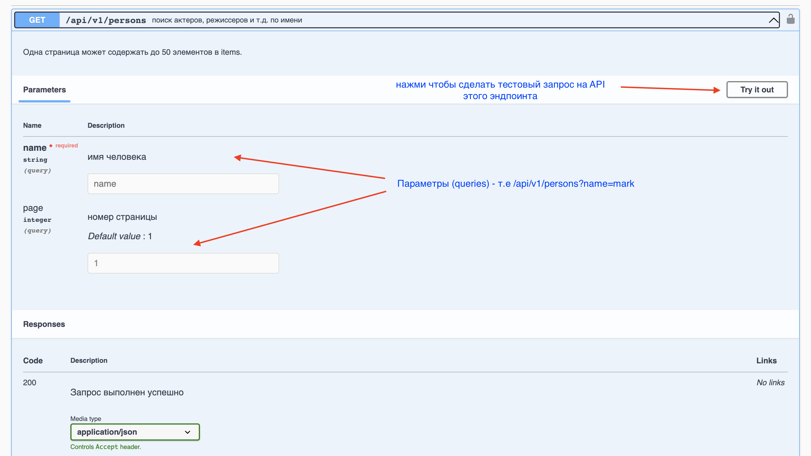
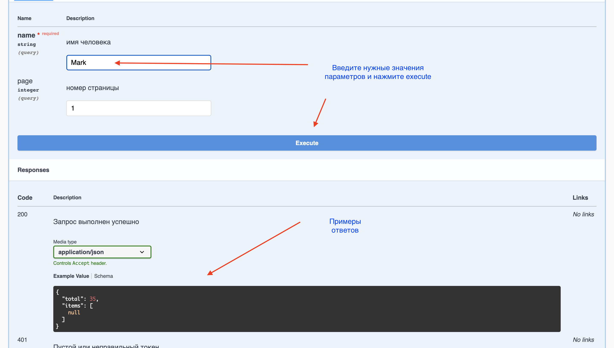
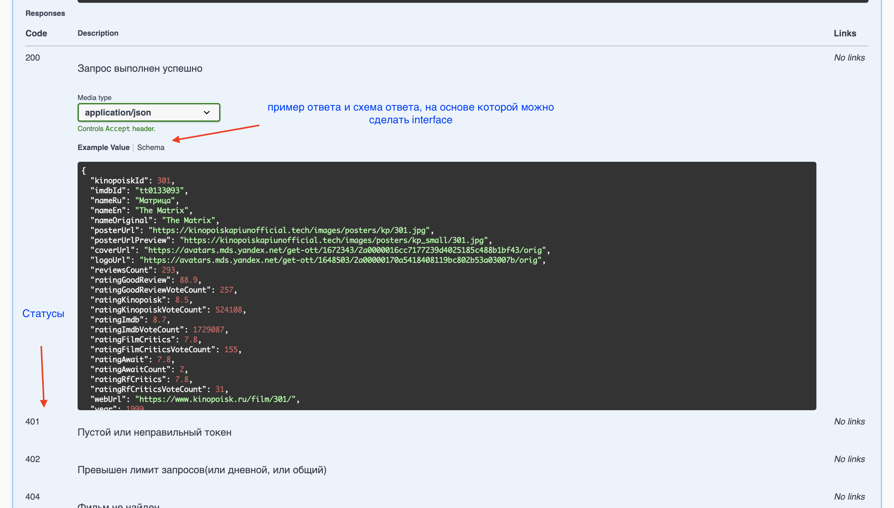
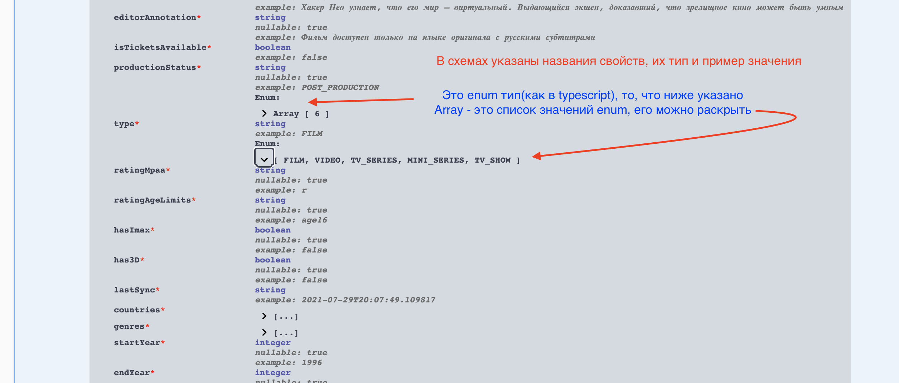

# Swagger

Во время интеграции проектов с backend нам часто приходится взаимодействовать с API при помощи сваггера и postman (он будет разобран отдельно). Ниже представлены основы работы с документацией по API в сваггере:

### Endpoints

На странице документации можно увидеть список всех эндпоинтов, по которым можно делать запрос.
Эндпоинты по общему пути, например staff на фото, объеденены в секцию, которую можно закрыть.

Снизу под эндпоинтами указаны [схемы](#schema)

> 

### Parameters

При нажатии на нужный endpoints откроется вся нужная информация - список параметров, пример ответа, схема ответов, статусы.

Обратите внимание, что в разделе parameters указываются как динамические пути, так и параметры. Например, `id` для `films/{id}` запроса, так и параметры (query) для запроса `name` параметр для `films/{id}?name=value`

Кнопка try it out позволяет сделать тестовый запрос.

> 

### Request

Вы можете протестировать работу API и попробовать разные параметры и тд. Если в проекте у вас идет запрос с ошибкой, проверьте сначала, работает ли запрос в swagger:

> 

### Response

Раздел response позволяет увидеть пример ответа и его схему, это особенно полезно для создания моков и интерфейсов ответа из API:

> 

### Schema

В схемах указаны общие для запросов интерфейсы, на основе них можно сделать типизацию ответов в `typescript`, отдельно посмотрите на фото, как смотреть значения `enum`:

> 

### Example

Вы можете сами посмотреть, как выглядит документация к API сваггера:

[Kinopoinsk API](https://kinopoiskapiunofficial.tech/documentation/api/#/)
