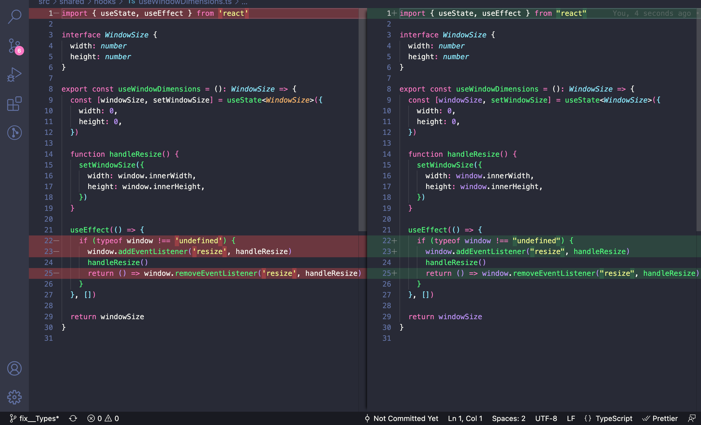
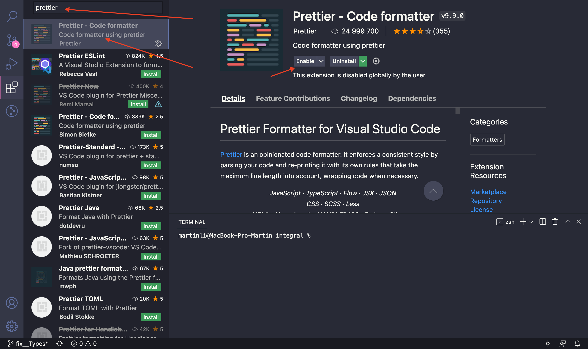
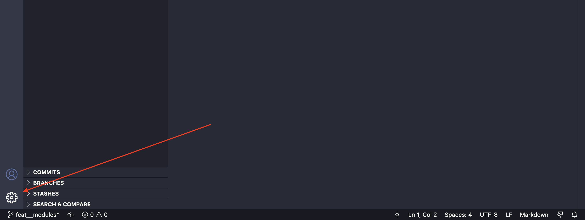
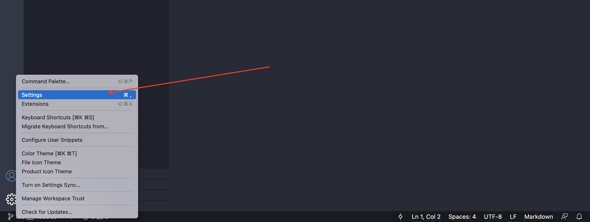
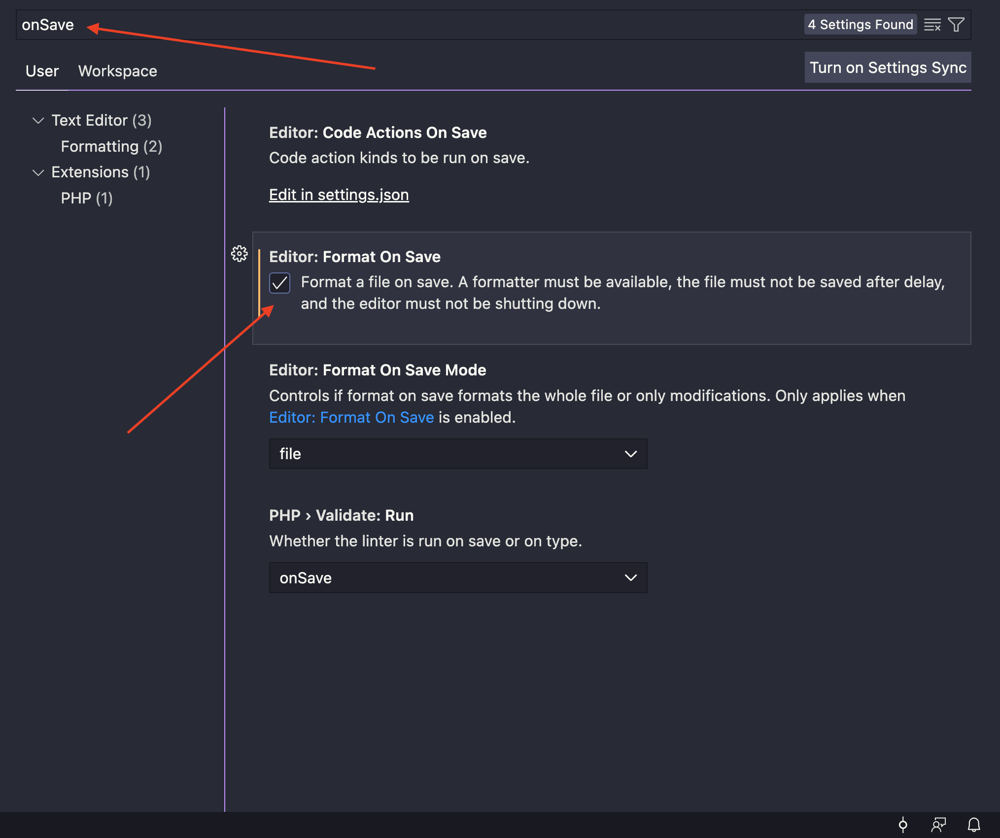
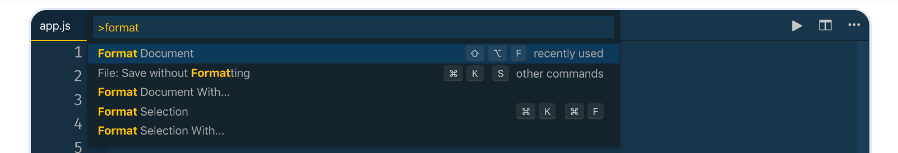
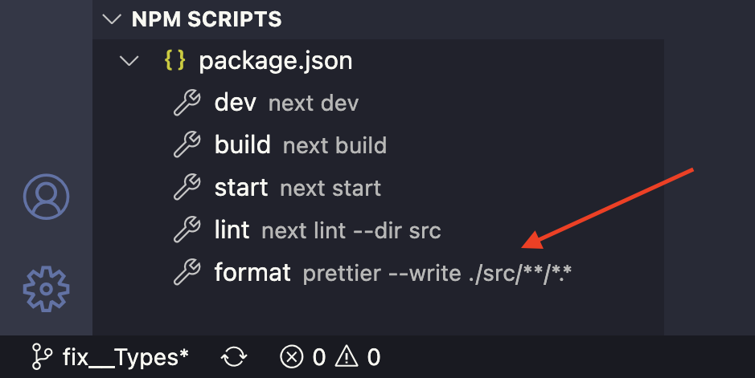

# Prettier

Проблемы с использованием prettier - одни из самых частных у начинающих разработчиков.

### Базовые правила

- Все ваши изменения в файлах должны быть согласно настройкам prettier в проекте
- Если вы видите что в одном файле у вас ковычки в разных стилях `'' и ""` то prettier не работает
- Если при сохранении изменений вы видите, что код стайл изменился(см ниже), то ваш prettier не использует настройки проекта
- Если по какой то причине вы заметили что часть файлов были не отформатированы, отформатируйте их отдельным коммитом

> Если вы видите такое при коммите, у вас проблемы с prettier:
>
> 

## Как настроить prettier?

### VS Code

1. Находим расширение `prettier` в разделе extenstions, оно должно быть включено(enabled):



2. Настраиваем форматирование файла по сохранению:







3. Проверяем работу prettier.

Для этого, откройте конфигурацию prettier (`.prettierrc`) в корне вашего проекта:

```js
// .prettierrc.js
// (конфигурация также может быть в .ts, .json формате и тд)
module.exports = {
  arrowParens: "avoid",
  endOfLine: "lf",
  printWidth: 80,
  singleQuote: true, // замените это свойство на противоположное
  jsxSingleQuote: true,
  tabWidth: 2,
  trailingComma: "es5",
  jsxBracketSameLine: false,
  semi: false,
};
```

Теперь откройте js, ts файл, измените его и сохраните. Должны поменяться кавычки во всем файле, например:


Prettier работает! Теперь верните назад настройки `.prettierrc.js` файла и работайте.

> Если у вас не сработало форматирование по сохранению, используйте `cmnd + shift + P` и введите `format`, вам будет предложено выбрать настройки из проекта, prettier сработает:
> 

4. Также можно использовать команду `npm format` из консоли, она отформатирует весь проект, лучше делать ее отдельным коммитом:



### Web Storm

TODO
