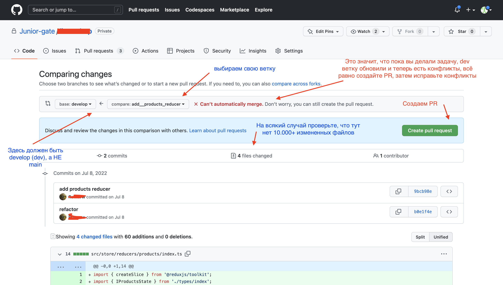
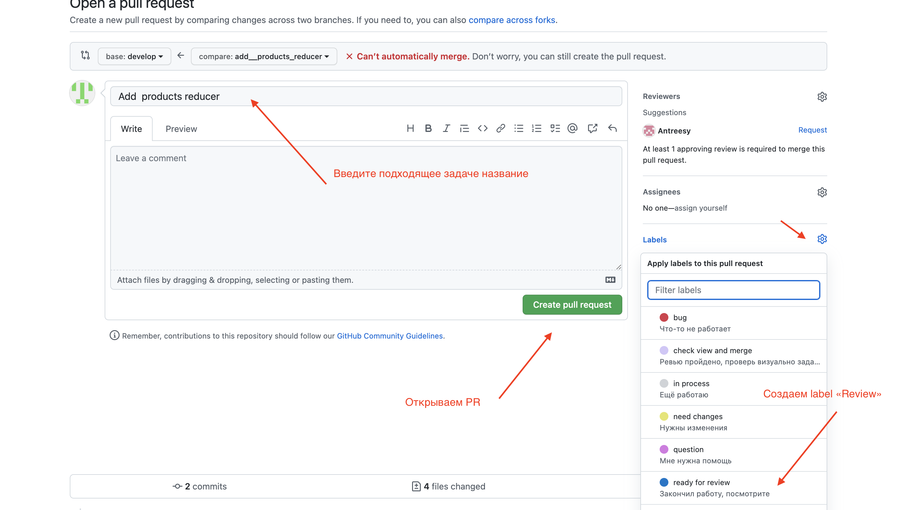
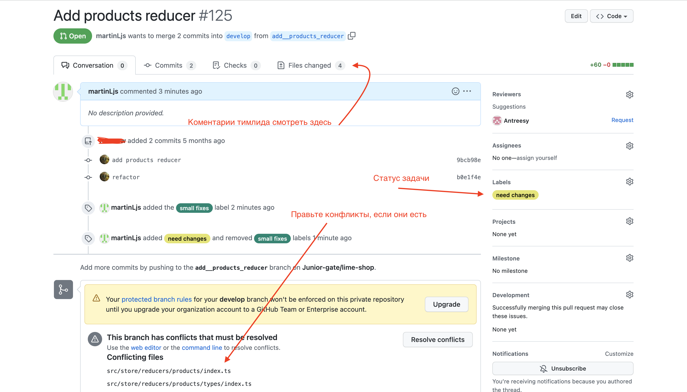
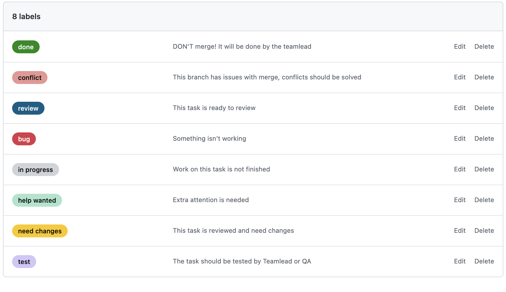

# Pull Request

После выполнения задачи, вам нужно открыть Pull Request (PR, ПР) в Github.

### Pulls

Пул реквесты находятся во вкладке pulls/ репозитория. Здесь можно посмотреть существующие PR и открыть свой.

> 

### Create Pull Request

На фото ниже наглядно показано, как создать Pull Request:

> 

После создания PR его нужно открыть:

> 

### PR Status

После ревью вы можете посмотреть комментарии тимлида, обновляйте [labels](#labels), решайте конфликты, когда это необходимо

> 

> Если ваша задача не прошла ревью, вы продолжаете работать с этим PR, а НЕ открываете новый!

### Labels

Базовое, что нужно знать о лэйблах:

1. Когда вы отправляете задачу на ревью, добавляйте `Review` тег
2. После ревью тимлид оставит `Need Changes `или `Small Fixes`
3. Если висит `Conflict`, то вам нужно поправить конфликты
4. Используйте `in progress` если задача еще не готова, `help` если вам нужна помощь
5. Если указаны лэйбл `Done` , `Merge` - то вы НИЧЕГО не делаете, мердж выполняет тимлид

> 

> И помните, НИКОГДА НЕ мерджите ветку сами! Это сделает тимлид
