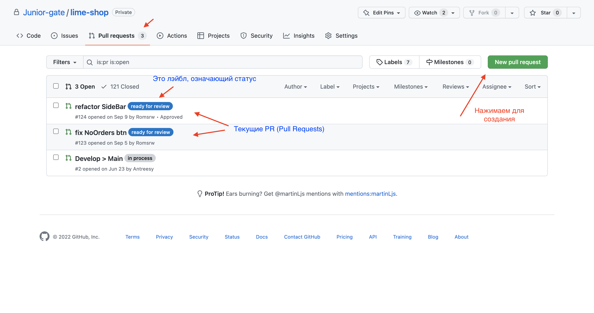
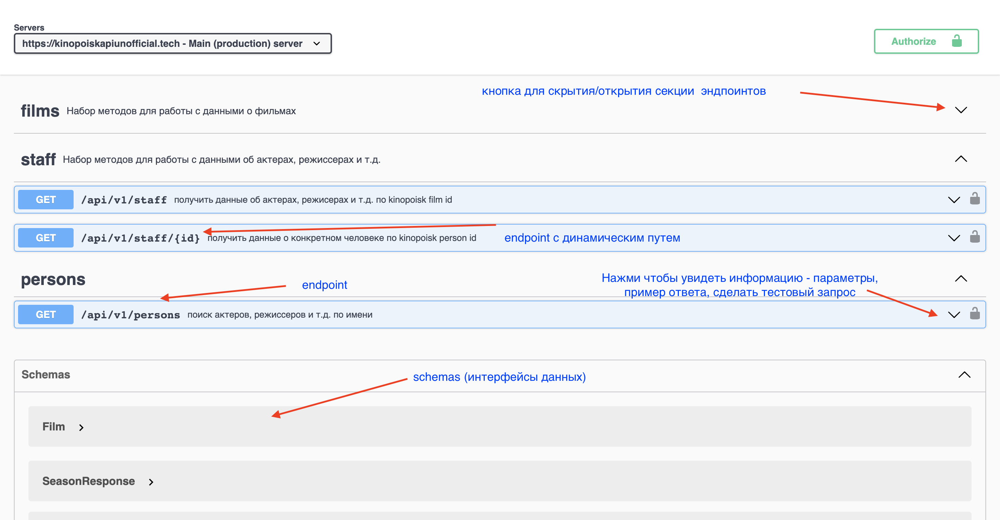

# Pull Request

После выполнения задачи, вам нужно открыть Pull Request (PR, ПР) в Github.

# Pulls

Пул реквесты находятся во вкладке pulls/ репозитория. Здесь можно посмотреть существующие PR и открыть свой.

> 

Во время интеграции проектов с backend нам часто приходится взаимодействовать с API при помощи сваггера и postman (он будет разобран отдельно). Ниже представлены основы работы с документацией по API в сваггере:

### Endpoints

На странице документации можно увидеть список всех эндпоинтов, по которым можно делать запрос.
Эндпоинты по общему пути, например staff на фото, объеденены в секцию, которую можно закрыть.

Снизу под эндпоинтами указаны [схемы](#schema)

> 

> 
